### Title: STEM Academy Match Analysis
#### Description: Going through our matches and how they went
Date: Dec 17 2023 
Logger: Yulian 
Witnesses: Henry, Daniel, Eric, Vince 

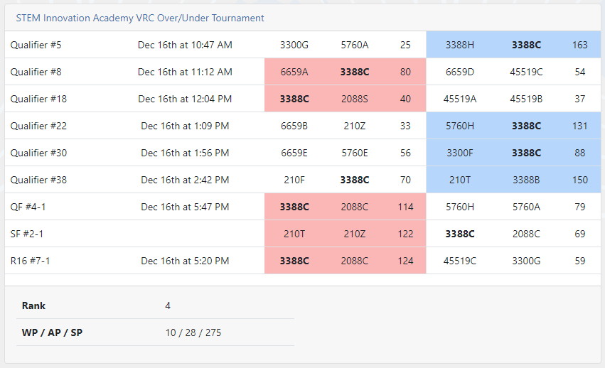

### Qualifications #5 Victory 163 - 25
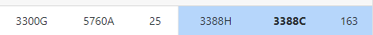
#### Inital thoughs:
5760A has a low profile and is able to descore, make sure not to double zone. 3388H is more consitent than us, they will matchload.
#### Game thoughts:
We did not use our autonomous for this game, but 3388H's autonomous won us the match point.
We immediately doublezoned, which as fine as there were not many triballs in our goal yet.
Both 3388H and 5760A began matchloading, we pushed triballs onto our offensive side. 3300G seemed stuck for a bit.
Near the end we got stuck on the elevation bar, maybe we could have done a low hang?

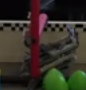
3388H did most of the heavy lifting in this game.

### Qualifications #8 Victory 80-54
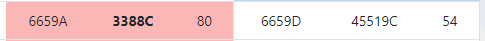
#### Inital thoughs:
Almost everyone was a simple push bot or a hero bot. We talked with our alliance before the match and decided we would matchload.
#### Game thoughts:
Our autonomous was still not ready for this game, so the opposing team won. 
We immediately got to match loading, Yulian and Eric were a bit slow, usually due to trying to place triballs at the same time, will need more practice, but overall not bad. 
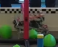

We were unable to get under the elevation bar, and were stuck on the opposing offensive side.  Additionally, our wings broke.
We still won the match, but we could have done better.

### Qualifications #18 Victory 40-37
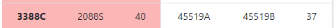

#### Inital thoughs:
Opposing teams aren't too sophisticated, should be an easy game. 2088S will matchload, we will score
#### Game thoughts:
2088S's radio disconnected, preventing them from matchloading 
All we were able to do was push some triballs into our own goal. This match should have been easier, but it was 3 point difference. We won, but that was lucky.

### Qualifications #18 Victory 40-37
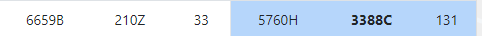

#### Inital thoughs:
6659B is not a threat, but 210Z is. Our teammate would matchload as we were better prepared to defend 210Z.
#### Game thoughts:
210Z won autonomous. 
210Z's radio disconnected while matchloading, which was very lucky for us. Out alliance threw triballs to our side and we scored them. At the end our teammate hanged on the middle barrier.
 
Also, one of the triballs got stuck in the middle of our bot, we were able to get it off by spining around, but should be considered when making our next bot.
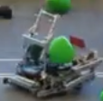

Very lucky match for us.

### Qualifications #30 Victory 88-56
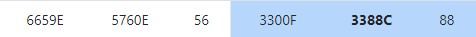

#### Inital thoughs:
6659E was able to matchload, 5760E was a hero bot. 3300F was a low push bot, we would matchload to them. 
Mr. Jacobs also came to check up on us before the match
#### Game thoughts:
We started the game by matchloading, the hero bot was unable to block us. Eric dropped a triball and picked it back up. Vince said we got a warning but it was fine as it was not match affecting, we will be more careful in the future.

The opposing team tried to push triballs through the alley, but we stopped them and pushed some back onto our side. Some into the matchload zone as well. 

This game we were able to make it under the elevation bar and onto our side to score some triballs.  
Not too bad of a game.

### Qualifications #38 Loss 70-150
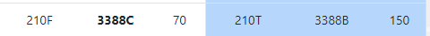

#### Inital thoughs:
Scary match, both 210T and 3388B are pretty good bots, luckly our alliance was too.
#### Game thoughts:
Game started well, both 210 teams started matchloading. We pushed 210T to prevent them from matchloading, they might have shot a few triballs when not touching the bar
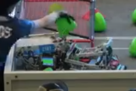

Unfortunately, 210F's bot broke down after they matchloaded and we lost. Seemed to be a radio issue? Also seems to be happening a lot with the 210 teams. 

### Now onto Eliminations! 